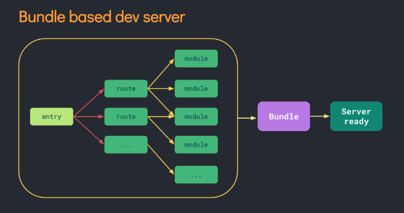
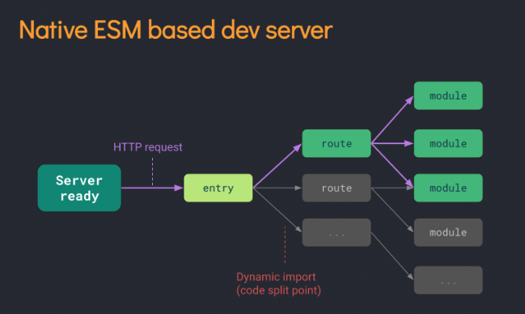
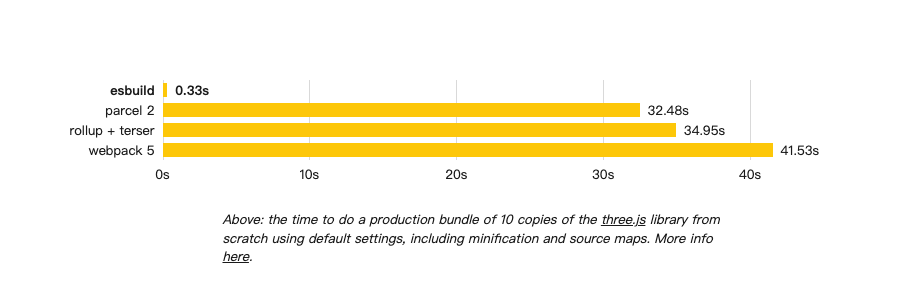
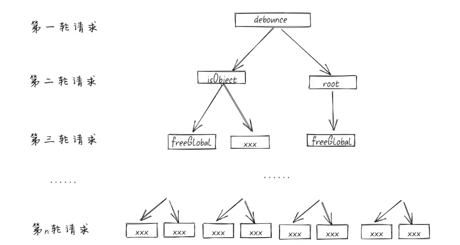

# vite 下一代前端开发与构建工具

## 目录

1. vite是什么、解决了什么问题
2. vite原理
3. vite插件开发
4. vite使用

## 

## vite是什么

Vite是一种新型的前端构建工具，是尤雨溪在开发Vue3.0的时候诞生的。类似于`webpack+webpack-dev-server`。利用浏览器`ESM`特性导入组织代码，在服务端按需编译返回，完全跳过了打包这个概念；而生产环境则是利用`Rollup`作为打包工具，号称是下一代的前端构建工具。

* `极速的服务启动`使用原生的ESM文件，无需打包
* `轻量快速的热重载`无论应用程序大小如何，都始终极快的模块热重载（HMR）
* `丰富的功能`对 TypeScript、JSX、CSS 等支持开箱即用。
* `优化的构建`可选 “多页应用” 或 “库” 模式的预配置 Rollup 构建
* `通用的插件`在开发和构建之间共享 Rollup-superset 插件接口。
* `完全类型化的API`灵活的 API 和完整的 TypeScript 类型。

## 我们为什么需要vite

传统的打包工具如`Webpack`是先解析依赖、打包构建再启动开发服务器，`Dev Server` 必须等待所有模块构建完成，当我们修改了 `bundle`模块中的一个子模块， 整个 `bundle` 文件都会重新打包然后输出。项目应用越大，启动时间越长。



## vite是怎么做的

Vite 通过在一开始将应用中的模块区分为 **依赖** 和 **源码** 两类，改进了开发服务器启动时间。

- **依赖** 大多为在开发时不会变动的纯 JavaScript。一些较大的依赖（例如有上百个模块的组件库）处理的代价也很高。依赖也通常会存在多种模块化格式（例如 ESM 或者 CommonJS）。

  Vite 将会使用 [esbuild](https://esbuild.github.io/) [预构建依赖](https://cn.vitejs.dev/guide/dep-pre-bundling.html)（处理CommonJs和UMD兼容性、合并http请求性能优化）。esbuild 使用 Go 编写，并且比以 JavaScript 编写的打包器预构建依赖快 10-100 倍。

- **源码** 通常包含一些并非直接是 JavaScript 的文件，需要转换（例如 JSX，CSS 或者 Vue/Svelte 组件），时常会被编辑。同时，并不是所有的源码都需要同时被加载（例如基于路由拆分的代码模块）。

Vite 以 [原生 ESM](https://developer.mozilla.org/en-US/docs/Web/JavaScript/Guide/Modules) 方式提供源码。这实际上是让浏览器接管了打包程序的部分工作：Vite 只需要在浏览器请求源码时进行转换并按需提供源码。根据情景动态导入代码，即只在当前屏幕上实际使用时才会被处理。





## ESM

在了解Vite之前，需要先了解下ESM，不同于之前的CJS，AMD，CMD等等，ESM提供了更原生以及更动态的模块加载方案，最重要的就是它是浏览器原生支持的，也就是说我们可以直接在浏览器中去执行import，动态引入我们需要的模块，而不是把所有模块打包在一起。

### 使用方式

```html
<script type="module">
  import message from './message.js'
  console.log(message) // hello world
</script>
```

也就是说 浏览器可以通过 `<script type="module">` 的方式和 import 的方式加载标准的 ES 模块 

###### 而且 模块只会执行一次并且默认为defer也支持async

传统的`<script>`如果引入的JS文件地址是一样的，则JS会执行多次。但是，对于`type="module"`的`<script>`元素，即使模块地址一模一样，也只会执行一次。例如：

```html
<!-- 1.mjs只会执行一次 -->
<script type="module" src="1.mjs"></script>
<script type="module" src="1.mjs"></script>
<script type="module">import "./1.mjs";</script>
<!-- 下面传统JS引入会执行2次 -->
<script src="2.js"></script>
<script src="2.js"></script>
```

## esbuild

Vite底层使用Esbuild实现对`.ts、jsx、.js`代码文件的转化，所以先看下什么是es-build。


esbuild 号称是新一代的打包工具，提供了与`Webpack`、`Rollup`、`Parcel` 等工具相似的资源打包能力，但在时速上达到10～100倍的差距，耗时是`Webpack`2%~3%

这是`Esbuild`首页的对比图。



`为啥这么快`


大多数前端打包工具都是基于 `JavaScript` 实现的，大家都知道`JavaScript`是解释型语言，边运行边解释。而 `Esbuild` 则选择使用 `Go` 语言编写，该语言可以编译为原生代码,在编译的时候都将语言转为机器语言，在启动的时候直接执行即可，在 `CPU` 密集场景下，`Go` 更具性能优势。


`为啥需要预编译`


依赖预编译，其实是 Vite 2.0 在为用户启动开发服务器之前，先用 `esbuild` 把检测到的依赖预先构建了一遍。

也许你会疑惑，不是一直说好的 no-bundle 吗，怎么还是走启动时编译这条路线了？

以导入 `lodash-es` 这个包为例。当你用 `import { debounce } from 'lodash'` 导入一个命名函数的时候，

可能你理想中的场景就是浏览器去下载只包含这个函数的文件。但其实没那么理想，`debounce` 函数的模块内部又依赖了很多其他函数，形成了一个依赖图。

当浏览器请求 `debounce` 的模块时，又会发现内部有 2 个 `import`，再这样延伸下去，这个函数内部竟然带来了 600 次请求，耗时会在 1s 左右。





再有就是去做模块化的兼容，对 `CommonJS` 模块进行分析，方便后面需要统一处理成浏览器可以执行的 `ES Module`。

## roolup

在生产环境下，Vite使用`Rollup`来进行打包


`Rollup`是基于`ESM`的JavaScript打包工具。它将小文件打包成一个大文件或者更复杂的库和应用，打包既可用于浏览器和Node.js使用。 Rollup最显著的地方就是能让打包文件体积很小。相比其他JavaScript打包工具，Rollup总能打出更小，更快的包。因为`Rollup`基于`ESM`，比Webpack和Browserify使用的CommonJS模块机制更高效。


## vite原理

核心原理

拦截浏览器对模块的请求并返回处理后的结果

浏览器发起的第一个请求自然是请求 `localhost:3000/`，这个请求发送到 Vite 后端之后经过静态资源服务器的处理，会进而请求到 `index.html`，此时 Vite 就开始对这个请求做拦截和处理了。


## vite插件

- `config`：可以在`Vite`被解析之前修改`Vite`的相关配置。钩子接收原始用户配置`config`和一个描述配置环境的变量`env`

- `configResolved`：解析`Vite`配置后调用，配置确认

- `configureserver`：主要用来配置开发服务器，为`dev-server`添加自定义的中间件

- `transformindexhtml`：主要用来转换`index.html`，钩子接收当前的 `HTML` 字符串和转换上下文

- `handlehotupdate`：执行自定义`HMR`更新，可以通过`ws`往客户端发送自定义的事件

### 常用的钩子

- 服务启动时调用一次
  - `options`: 获取、操纵`Rollup`选项
  - `buildstart`：开始创建

- 在每个传入模块请求时被调用
  - `resolveId`: 创建自定义确认函数，可以用来定位第三方依赖
  - `load`：可以自定义加载器，可用来返回自定义的内容
  - `transform`：在每个传入模块请求时被调用，主要是用来转换单个模块

- 服务关闭时调用一次
  - `buildend`：在服务器关闭时被调用
  - `closeBundle`


```typescript
/**
 * 
 * @param options?: {defaultEnv = 'dev', key = 'APP_ENV'}} 
 * @returns 
 */
export default function CommandSetEnv(options: Options) {
    const { defaultEnv = 'dev', key = 'APP_ENV' } = options;
    const commandArgs = getCommandArgv() || defaultEnv;

    return {
        name: 'vite-plugin-env-command',
        config: () => ({
            define: {
                'process.env': JSON.stringify({
                    [key]: commandArgs
                }),
            }
        })
    }
}
```


[可以借鉴 预编译的部分 https://juejin.cn/post/6932367804108800007](https://juejin.cn/post/6932367804108800007) 

[webpack 的 scope hoisting 是什么？](https://segmentfault.com/a/1190000018220850)


